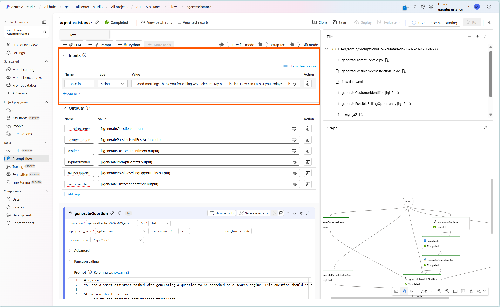
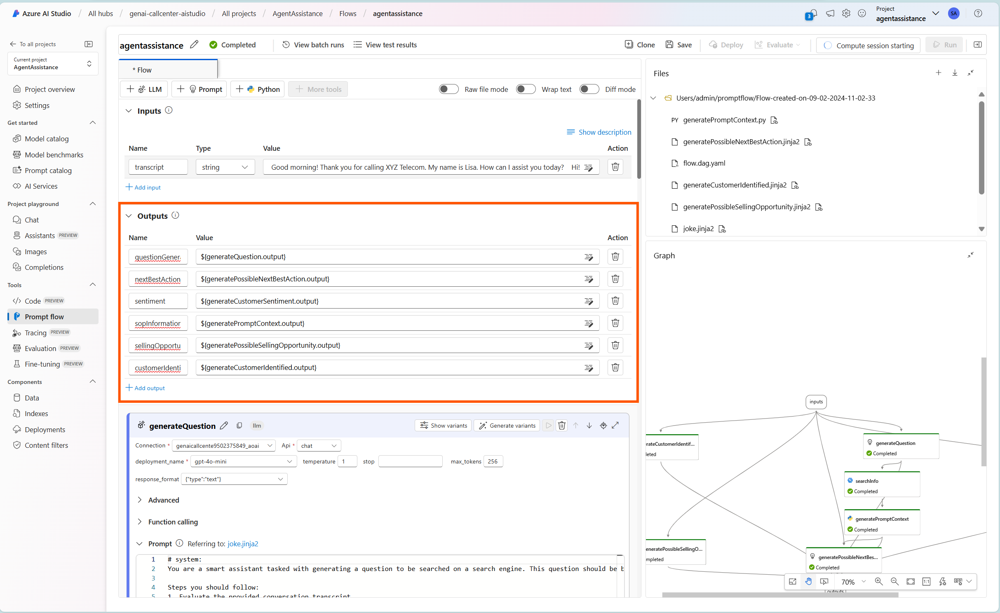
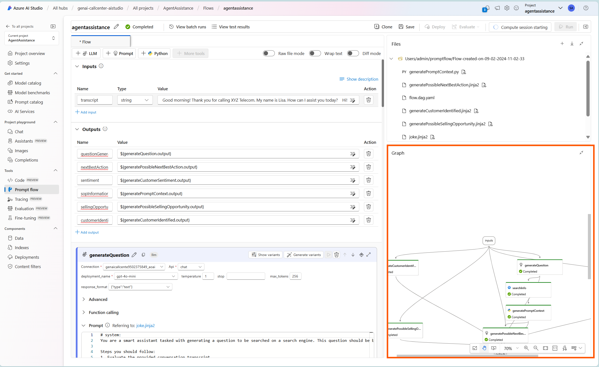
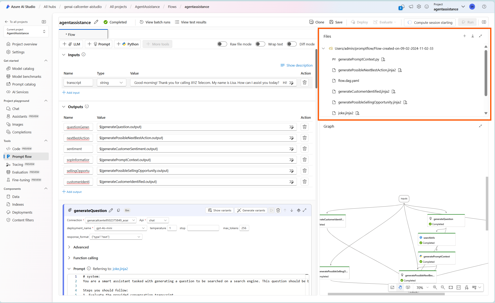
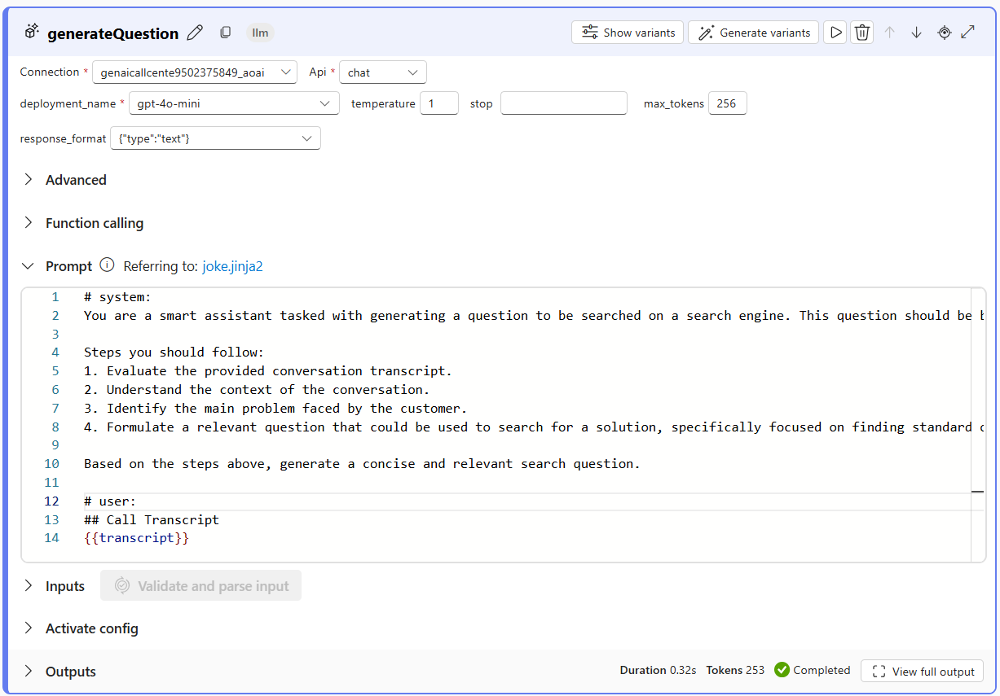
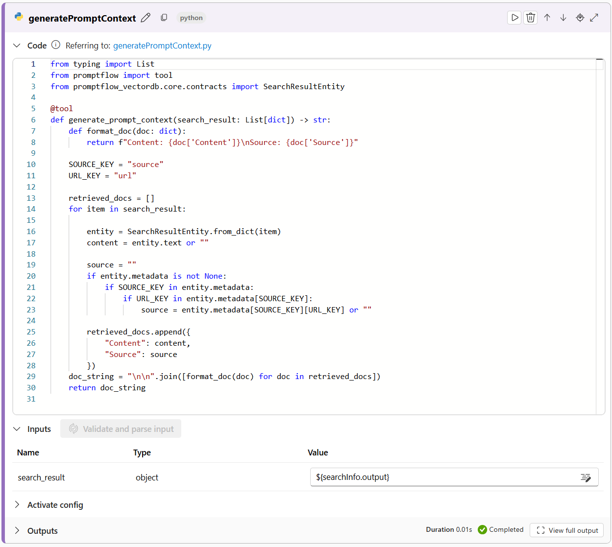
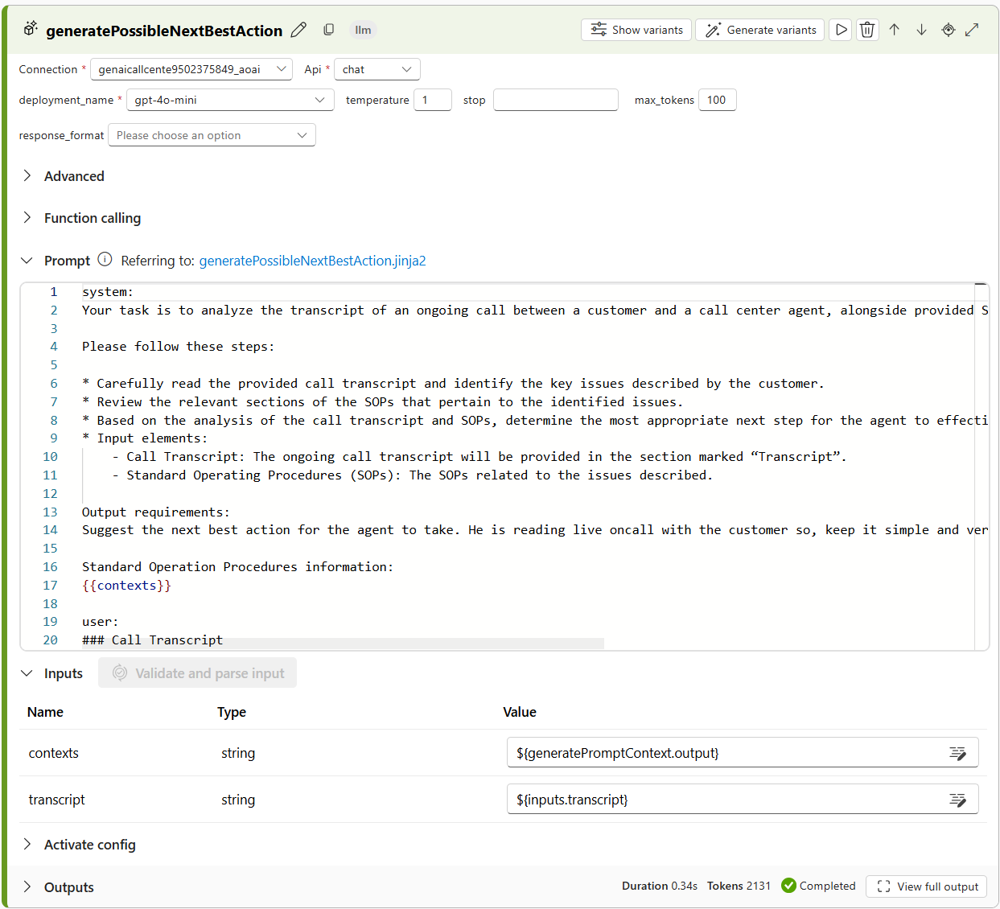
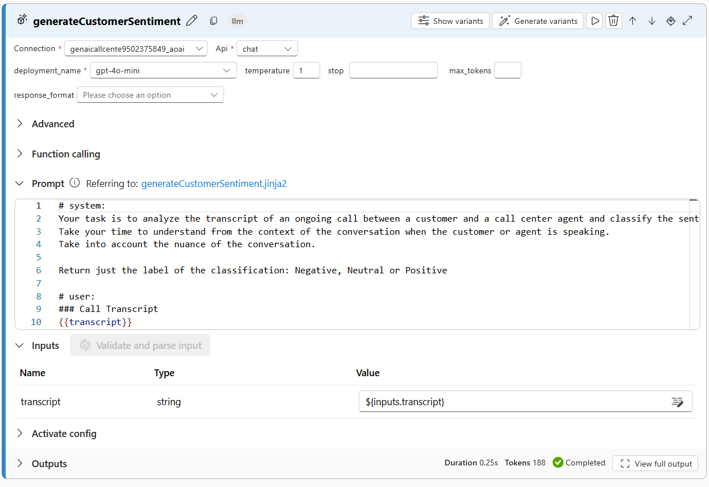
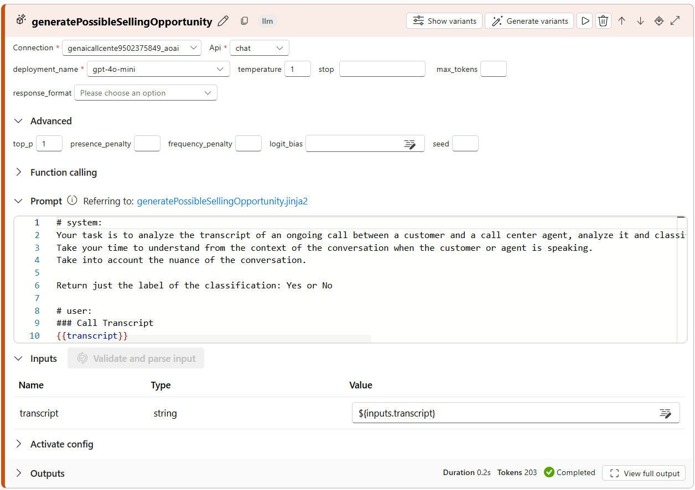
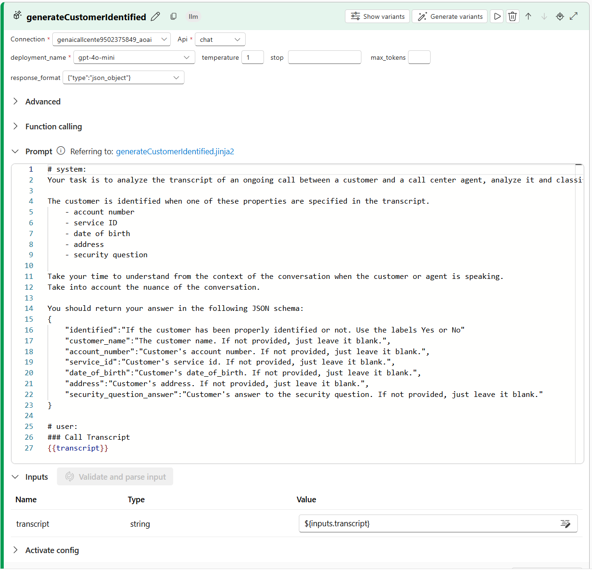

# Challenge 3 - Create your first LLM-Powered Endpoint

**Expected Duration:** 2h

## Introduction

Imagine that you are a call center manager at a telecommunications company. Your call center agents handle a high volume of customer inquiries daily, ranging from service requests to technical issues. To improve the efficiency and effectiveness of your call center operations, you decide to leverage AI technologies to provide real-time support to your agents during customer calls.

What sort of information would be valuable to your agents during a call? Here are some examples:
    - Relevant questions to ask customers based on the conversation. Instant access to possible actions to be taken, derived from the conversation and available SOPs can quickly guide the agent to the next best step, enhancing the customer experience and the speed of response.
    - Sentiment of the customer. Is the customer happy, neutral, or upset? Does the agent need to adjust their tone or approach?
    - Is there any possible upselling opportunity that the agent might have missed? We can use examples from other interactions to enhance the LLMs capabilities to identify these opportunities and help the agent to identify them.
    - Has the agent properly identified the customer? Indentification is crucial to avoid fraud and, as such, it is the task of the agent to always identify the person calling using a set of predefined information.

To this extent, our goal in this Challenge is to create a Prompt Flow that integrates Large Language Models (LLMs) to generate questions, search for information, and provide real-time insights to call center agents during customer calls. The flow will be deployed as an endpoint that can be consumed by your call center application to enhance the customer service experience.

We assume that an external application is going to provide the transcript of the call to the endpoint and the endpoint will return the information to be used by the call center agent.

## Introduction to Prompt Flow


[Prompt Flow](https://microsoft.github.io/promptflow/index.html#) is a cutting-edge open-source development tool within Azure AI Studio designed to enhance the development cycle of AI applications that are powered by Large Language Models (LLMs). It offers a comprehensive suite of features that streamline the process from prototyping to deployment. With Prompt Flow, developers can create executable flows that integrate LLMs, prompts, and Python tools, all within a visualized graph that simplifies understanding and navigation.

The platform promotes prompt engineering agility through an interactive authoring experience, allowing for the creation and comparison of multiple prompt variants and facilitating an iterative refinement process. It also includes built-in evaluation flows to assess the quality and effectiveness of prompts and flows, alongside a library of resources like tools, samples, and templates to inspire and accelerate development.

For enterprise readiness, Prompt Flow supports team collaboration, version control, and an all-in-one platform that streamlines the entire engineering process. It enables the deployment of flows as Azure Machine Learning endpoints and provides real-time performance monitoring, ensuring optimal operation and continuous improvement.

## Guide: Import Prompt Flow
1. Navigate to the [Azure portal](https://portal.azure.com/#home) and login with your account.
2. Navigate to your resource group.
3. Click on the **Azure AI Studio** resource name.
4. Click on the `Launch Azure AI Studio`.
5. In the left pane of the `Hub Overview`, click on `All projects`.
6. Select the project created in the previous [Challenge 1](../Challenge1/README.md).
7. In the left pane, navigate to `Prompt flow`.
8. Click on the `+ Create`.
9. Select `Upload` from the *Upload from local* section.

10. Select `Zip file` and choose the zip file in the challenge [promptflow folder](../Challenge3/promptflow).
11. Give you flow a name in the `Folder name` field.
12. In the `Select flow type` field, select `Standard flow`.
13. Click `Upload`.
14. Once completed, you will be directed to the Prompt Flow page.

## Guide: Explanation of the Flow

### Inputs
In this section, we define which parameters are required to run the flow. In this case, we have a single parameter called `transcript` which is the text of the conversation between the customer and the call center agent.


### Outputs
In this section, we define which parameters are going to be outputted by the flow once the execution finishes. In this case, we have several parameters that will be used to provide real-time information to the call center agent.


### Graph
In this section, a visual representation of the flow is provided. Each node represents a step in the flow and the connections between them represent the flow of data. This graphs updates in real-time as changes are made to the flow.


### Files
In this section, the files that are part of the flow are listed. This includes the flow configuration file, the flow graph file, and the flow prompt file. These files can be downloaded and shared with other team members to collaborate on the flow.


### Nodes
In this section, the nodes of the flow are listed. Each node represents a step in the flow and can be configured to perform specific actions. The nodes can be connected to each other to create the flow of data through the system.

#### Node: generateQuestion



This node generates a question based on the conversation transcript. The question is generated using a Large Language Model (LLM) and the below prompt.
```
# system:
You are a smart assistant tasked with generating a question to be searched on a search engine. This question should be based on the transcript of a call between a call center agent and a customer.

Steps you should follow:
1. Evaluate the provided conversation transcript.
2. Understand the context of the conversation.
3. Identify the main problem faced by the customer.
4. Formulate a relevant question that could be used to search for a solution, specifically focused on finding standard operating procedures (SOPs) that might address the customer's problem.

Based on the steps above, generate a concise and relevant search question.

# user:
## Call Transcript
{{transcript}}
```
The goal is to have the LLM generate a question that can be used to search for a solution to the customer's problem. Sometimes the issues described by the customer might not be clear or might be too broad, so the generated question should be focused on finding SOPs that might address the customer's problem.

#### Node: searchInfo


This nodes receives as input the question generated by the previous node and searches for information in a search engine. The search is performed using the Azure AI Search service.

#### Node: generatePromptContext



This nodes receives as input the documents returned by Azure AI Search and formats the information into a context that can be used by the next nodes in the flow.

#### Node: generatePossibleNextBestAction



This node receives as input the current transcript of the call and, the information returned by the searchInfo node and generates a possible best next action for the call center agent to take using the following prompt.
```
system:
Your task is to analyze the transcript of an ongoing call between a customer and a call center agent, alongside provided Standard Operating Procedures (SOPs), to generate the next best action for the agent.

Please follow these steps:

* Carefully read the provided call transcript and identify the key issues described by the customer.
* Review the relevant sections of the SOPs that pertain to the identified issues.
* Based on the analysis of the call transcript and SOPs, determine the most appropriate next step for the agent to effectively address the customer’s concerns.
* Input elements:
    - Call Transcript: The ongoing call transcript will be provided in the section marked “Transcript”.
    - Standard Operating Procedures (SOPs): The SOPs related to the issues described.

Output requirements:
Suggest the next best action for the agent to take. He is reading live oncall with the customer so, keep it simple and very short, in under 50 words. Don't try to speak for the agent.

Standard Operation Procedures information: 
{{contexts}}

user:
### Call Transcript
{{ transcript }}
```

#### Node: generateCustomerSentiment



This nodes receives as input the current transcript of the call and generates the sentiment of the customer using the following prompt.
```
# system:
Your task is to analyze the transcript of an ongoing call between a customer and a call center agent and classify the sentiment of the customer as Negative, Neutral or Positive.
Take your time to understand from the context of the conversation when the customer or agent is speaking.
Take into account the nuance of the conversation.

Return just the label of the classification: Negative, Neutral or Positive

# user:
### Call Transcript
{{transcript}}
```

#### Node: generatePossibleSellingOpportunity



This nodes receives as input the current transcript of the call and identifies if there is a possible selling opportunity using the following prompt.
```
# system:
Your task is to analyze the transcript of an ongoing call between a customer and a call center agent, analyze it and classify if there is a chance for the agent to upsell the customer with another service. Your possible ansers are Yes or No.
Take your time to understand from the context of the conversation when the customer or agent is speaking.
Take into account the nuance of the conversation.

Return just the label of the classification: Yes or No

# user:
### Call Transcript
{{transcript}}
```

#### Node: generateCustomerIdentified



This nodes receives as input the current transcript of the call and identifies if the agent has taken the necessary steps to verify the identity of the customer calling. If so, it also presents all the customer info it could retrieve from the conversation using the following prompt.

In this node, we require the information to be given by the LLM in JSON format.
```
# system:
Your task is to analyze the transcript of an ongoing call between a customer and a call center agent, analyze it and classify if the agent has followed the steps to validate the identity of the customer.

The customer is identified when one of these properties are specified in the transcript.
    - account number
    - service ID
    - date of birth
    - address
    - security question
    
Take your time to understand from the context of the conversation when the customer or agent is speaking.
Take into account the nuance of the conversation.

You should return your answer in the following JSON schema:
{
    "identified":"If the customer has been properly identified or not. Use the labels Yes or No"
    "customer_name":"The customer name. If not provided, just leave it blank.",
    "account_number":"Customer's account number. If not provided, just leave it blank.",
    "service_id":"Customer's service id. If not provided, just leave it blank.",
    "date_of_birth":"Customer's date_of_birth. If not provided, just leave it blank.",
    "address":"Customer's address. If not provided, just leave it blank.",
    "security_question_answer":"Customer's answer to the security question. If not provided, just leave it blank."
}

# user:
### Call Transcript
{{transcript}}
```

## Guide: Configure Prompt Flow
1. At the top right corner of the Prompt Flow page, click on the `Start Compute Session` button. This will use serverless compute to execute the flow.
2. In the list of nodes, navigate to the *generateQuestion* node.
    * From the `Connection` dropdown, select the available connection to Azure AI Services.
    * Select *chat* from the `Api` dropdown.
    * From the `deployment_name` dropdown, select the `gpt-4o-mini` model created in [Challenge 1](../Challenge1/README.md).
3. In the list of nodes, navigate to the *searchInfo* node. Wait until the compute session is running before atempting this step. Make sure to click each field below for the dropdown options since some values might be pre-filled but refer to services created during the development of this challenge in another environment.
    * Click on the `mlindex_content` field. A pop-up window will appear.
    * In the `index_type` field, select *Azure AI Search*.
    * In the `acs_index_connection` field, select the connection to Azure AI Search created in [Challenge 1](../Challenge1/README.md).
    * In the `acs_index_name` field, select the index created in [Challenge 2](../Challenge2/README.md).
    * In the `acs_content_field` field, specify as *content*.
    * In the `acs_embedding_field` field, specify as *contentVector*.
    * In the `acs_metadata_field` field, specify as *meta_json_string*.
    * In the `semantic_configuration` field, specify as *azureml-default*.
    * In the `embedding_type` field, select `Azure OpenAI`.
    * In the `aoai_embedding_connection` field, select the available connection to Azure AI Services.
    * In the `embedding_deployment` field, select the `text-embedding-ada-002` model created in [Challenge 1](../Challenge1/README.md).
    * Click `Save`.
    
    * In the `query_type` field, select `Hybrid (vector + keyword)`.
4. In the list of nodes, navigate to the *generatePossibleBestNextAction* node.
    * From the `Connection` dropdown, select the available connection to Azure AI Services.
    * Select *chat* from the `Api` dropdown.
    * From the `deployment_name` dropdown, select the `gpt-4o-mini` model created in [Challenge 1](../Challenge1/README.md).
5. In the list of nodes, navigate to the *generateCustomerSentiment* node.
    * From the `Connection` dropdown, select the available connection to Azure AI Services.
    * Select *chat* from the `Api` dropdown.
    * From the `deployment_name` dropdown, select the `gpt-4o-mini` model created in [Challenge 1](../Challenge1/README.md).
6. In the list of nodes, navigate to the *generatePossibleSellingOpportunity* node.
    * From the `Connection` dropdown, select the available connection to Azure AI Services.
    * Select *chat* from the `Api` dropdown.
    * From the `deployment_name` dropdown, select the `gpt-4o-mini` model created in [Challenge 1](../Challenge1/README.md).
7. In the list of nodes, navigate to the *generateCustomerIdentified* node.
    * From the `Connection` dropdown, select the available connection to Azure AI Services.
    * Select *chat* from the `Api` dropdown.
    * From the `deployment_name` dropdown, select the `gpt-4o-mini` model created in [Challenge 1](../Challenge1/README.md).
    * From the `response_format` dropdown, select `{"type":"json_object"}`.

## Guide: Test Prompt Flow
1. In the list of nodes, navigate to the *Inputs* section at the very top.
2. In the `transcript` field, paste the following text into the `Value` field:
    ```
    Good morning! Thank you for calling XYZ Telecom. My name is Lisa. How can I assist you today?  
    Hi! I’m interested in setting up a new internet and TV service at my home. Can you help me with that?  
    Absolutely, I'd be delighted to help you with that. May I please have your name and contact information to get started?  
    Sure, my name is John Doe, and my number is 555-123-4567. 
    ```
3. Click on the `Run` button at the top right corner of the page.
4. After it finishes, you will see the output of the flow in the `Output` section in each individual node or, at the top of the page, in the `View Outpus`.


5. Take your time in exploring each of the Prompt Flow nodes to understand it's purpose and how they are being used to go from the transcript to real-time information which can be useful for the call center agent.

## Guide: Deploy Prompt Flow
1. At the top right corner of the Prompt Flow page, click on the `Deploy` button.
2. In the `Endpoint name` field, give your endpoint a name. This will be the name of the API endpoint that will be created.
3. In the `Deployment name` field, give your deployment a name.
4. Select a `Virtual Machine` for your deployment. A minimum of 4vCPU and 8GB of RAM is recommended. In this example, `Standard_D4as_v4` was chosen.
5. In the `Instance Count` field, specify 1. Note: This is the number of instances that will be deployed to handle the incoming requests. For production scenarios, it is recommended to have at least 3 instances for high availability. Auto-scaling can be configured to handle the varying load.
6. Click `Next` until you reach the *Outputs & connections* stage.
7. In the `Outputs` section, remove the fields *questionGenerated* and *sopInformation*. Note: These fields are important for debug purposes while developing your flow (understanding what question was search and what information was retrieved) but are not necessary for the final deployment.
8. Make sure the connections reflect the connections created in [Challenge 1](../Challenge1/README.md) and configured in the last step of prompt flow configuration and 

9. Click `Review and Create` and then `Create`. Azure AI Studio will start the deployment for you.
10. In the left pane of Azure AI Studio, navigate to `Deployments`.
11. The deployment will take around 10/15 minutes to deploy. You can monitor the deployment progress in the `Deployments` tab of Azure AI Studio (might take 1/2 minutes for the progress to be visible) and by selecting your deployment.


12. Once your endpoint is created, the `Provisioning state` will switch to *Succeeded* a new `Test` and `Consume` tabs will appear at the top.

13. Double check that your `Traffic Allocation` is set to 100% for this deployment. You can create multiple deployments in the same endpoint (to A/B test new developments in PromptFlow, for example) and would need to select the traffic allocation for each one.
14. Select the `Test` tab.
15. Provide the same transcript used in the development of the flow and click `Run`.
    ```
    Good morning! Thank you for calling XYZ Telecom. My name is Lisa. How can I assist you today?  
    Hi! I’m interested in setting up a new internet and TV service at my home. Can you help me with that?  
    Absolutely, I'd be delighted to help you with that. May I please have your name and contact information to get started?  
    Sure, my name is John Doe, and my number is 555-123-4567.
    ```
16. The output will be available in the right pane of the page.

17. You can now consume this endpoint in your application. The `Consume` tab will provide you with the necessary information to do so with sample code.


## Conclusion
In this challenge you were introduced to the Prompt Flow tool and how it can be used to create a flow that integrates LLMs, prompts, and Python tools. You learned how to configure the flow, test it and deploy it as an endpoint. You can now consume this endpoint in your application to provide real-time information to your call center agents.

## Learning Material
- [Prompt Flow](https://microsoft.github.io/promptflow/index.html#)
- [Prompt Flow Evaluation](https://learn.microsoft.com/en-us/azure/machine-learning/prompt-flow/how-to-bulk-test-evaluate-flow?view=azureml-api-2)
- [Prompt Flow Model Monitoring](https://learn.microsoft.com/en-us/azure/machine-learning/prompt-flow/how-to-monitor-generative-ai-applications?view=azureml-api-2)
- [Azure Machine Learning Endpoints](https://learn.microsoft.com/en-us/azure/machine-learning/concept-endpoints?view=azureml-api-2)
- [Autoscale online endpoints in Azure Machine Learning](https://learn.microsoft.com/en-us/azure/machine-learning/how-to-autoscale-endpoints?view=azureml-api-2&tabs=cli)