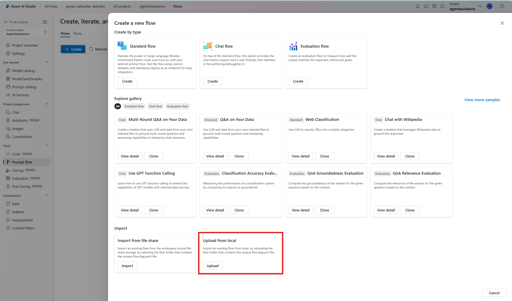
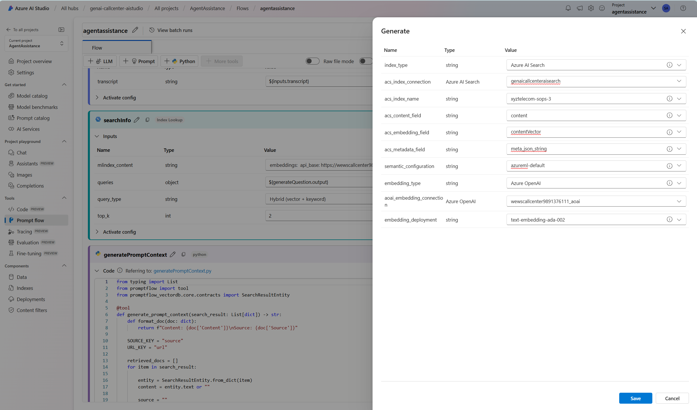
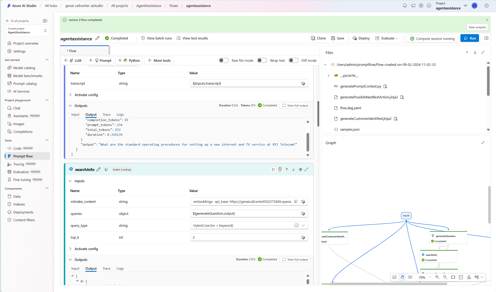
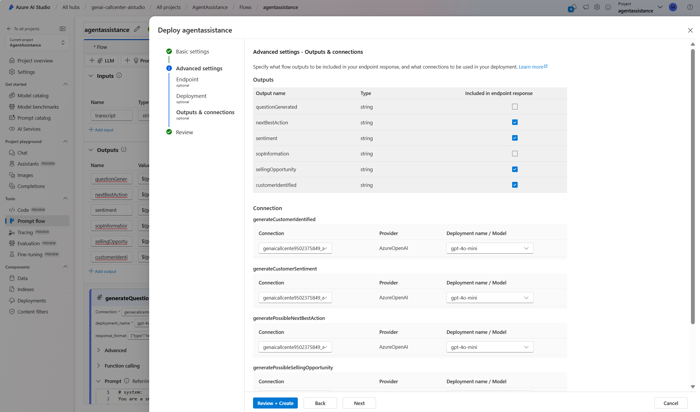
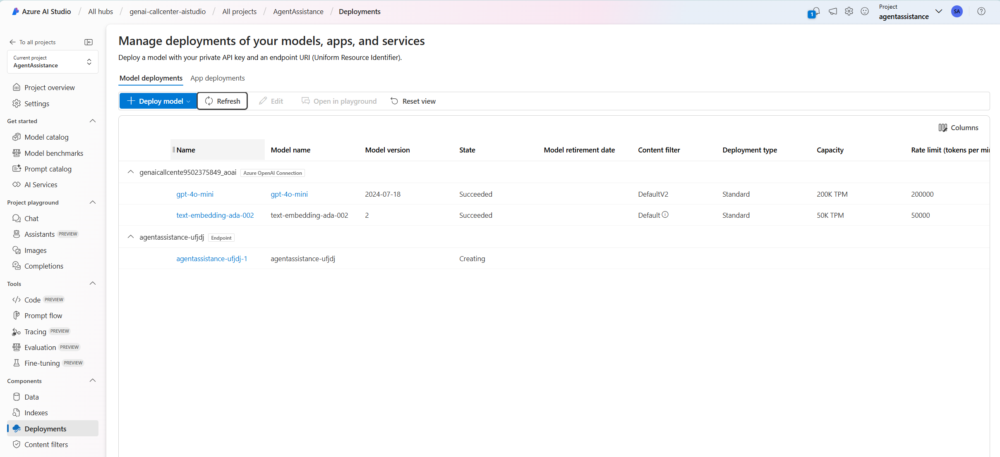
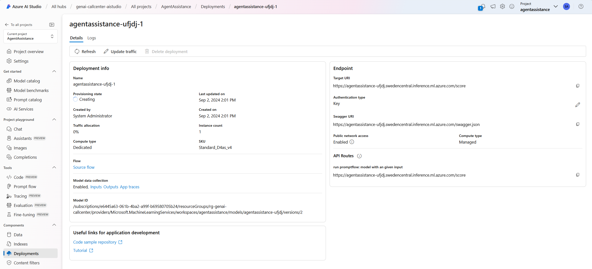
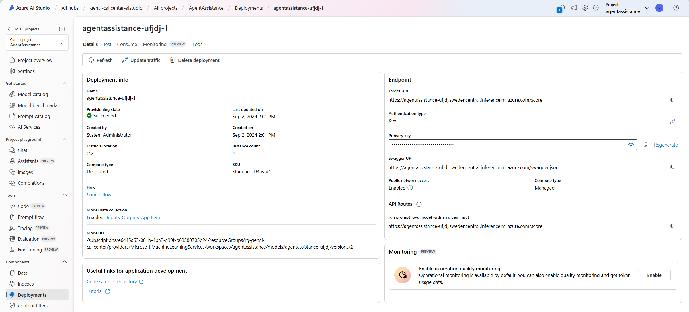
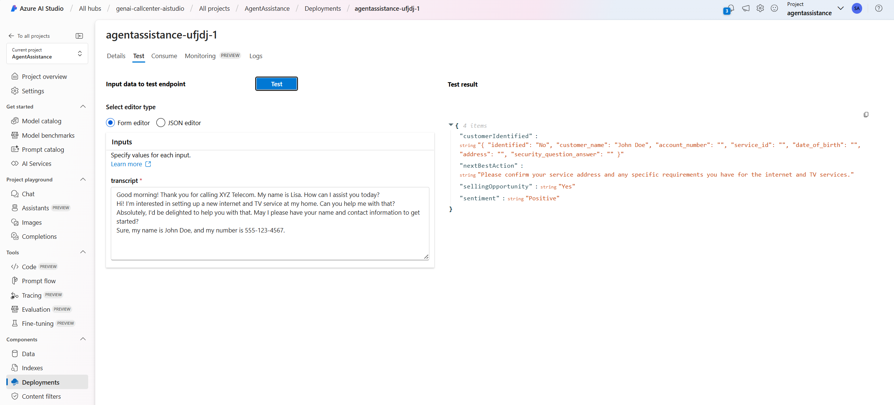
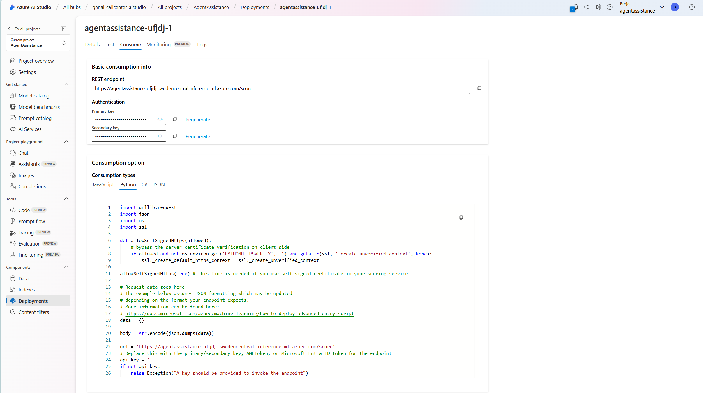

# Challenge 3 - Create your first LLM-Powered Endpoint

**Expected Duration:** 2h

## Introduction

## Introduction to Prompt Flow

**TO BE DONE**

## Our scenario

**TO BE DONE**

## Guide: Import Prompt Flow
1. Navigate to the [Azure portal](https://portal.azure.com/#home) and login with your account.
2. Navigate to your resource group.
3. Click on the **Azure AI Studio** resource name.
4. Click on the `Launch Azure AI Studio`.
5. In the left pane of the `Hub Overview`, click on `All projects`.
6. Select the project created in the previous [Challenge 1](../Challenge1/README.md).
7. In the left pane, navigate to `Prompt flow`.
8. Click on the `+ Create`.
9. Select `Upload` from the *Upload from local* section.

10. Select `Zip file` and choose the zip file in the challenge [promptflow folder](../Challenge3/promptflow).
11. Give you flow a name in the `Folder name` field.
12. In the `Select flow type` field, select `Standard flow`.
13. Click `Upload`.
14. Once completed, you will be directed to the Prompt Flow page.

## Guide: Explanation of the Flow

**TO BE DONE**

## Guide: Configure Prompt Flow
1. At the top right corner of the Prompt Flow page, click on the `Start Compute Session` button. This will use serverless compute to execute the flow.
2. In the list of nodes, navigate to the *generateQuestion* node.
    * From the `Connection` dropdown, select the available connection to Azure AI Services.
    * Select *chat* from the `Api` dropdown.
    * From the `deployment_name` dropdown, select the `gpt-4o-mini` model created in [Challenge 1](../Challenge1/README.md).
3. In the list of nodes, navigate to the *searchInfo* node. Wait until the compute session is running before atempting this step. Make sure to click each field below for the dropdown options since some values might be pre-filled but refer to services created during the development of this challenge in another environment.
    * Click on the `mlindex_content` field. A pop-up window will appear.
    * In the `index_type` field, select *Azure AI Search*.
    * In the `acs_index_connection` field, select the connection to Azure AI Search created in [Challenge 1](../Challenge1/README.md).
    * In the `acs_index_name` field, select the index created in [Challenge 2](../Challenge2/README.md).
    * In the `acs_content_field` field, specify as *content*.
    * In the `acs_embedding_field` field, specify as *contentVector*.
    * In the `acs_metadata_field` field, specify as *meta_json_string*.
    * In the `semantic_configuration` field, specify as *azureml-default*.
    * In the `embedding_type` field, select `Azure OpenAI`.
    * In the `aoai_embedding_connection` field, select the available connection to Azure AI Services.
    * In the `embedding_deployment` field, select the `text-embedding-ada-002` model created in [Challenge 1](../Challenge1/README.md).
    * Click `Save`.
    
    * In the `query_type` field, select `Hybrid (vector + keyword)`.
4. In the list of nodes, navigate to the *generatePossibleBestNextAction* node.
    * From the `Connection` dropdown, select the available connection to Azure AI Services.
    * Select *chat* from the `Api` dropdown.
    * From the `deployment_name` dropdown, select the `gpt-4o-mini` model created in [Challenge 1](../Challenge1/README.md).
5. In the list of nodes, navigate to the *generateCustomerSentiment* node.
    * From the `Connection` dropdown, select the available connection to Azure AI Services.
    * Select *chat* from the `Api` dropdown.
    * From the `deployment_name` dropdown, select the `gpt-4o-mini` model created in [Challenge 1](../Challenge1/README.md).
6. In the list of nodes, navigate to the *generatePossibleSellingOpportunity* node.
    * From the `Connection` dropdown, select the available connection to Azure AI Services.
    * Select *chat* from the `Api` dropdown.
    * From the `deployment_name` dropdown, select the `gpt-4o-mini` model created in [Challenge 1](../Challenge1/README.md).
7. In the list of nodes, navigate to the *generateCustomerIdentified* node.
    * From the `Connection` dropdown, select the available connection to Azure AI Services.
    * Select *chat* from the `Api` dropdown.
    * From the `deployment_name` dropdown, select the `gpt-4o-mini` model created in [Challenge 1](../Challenge1/README.md).
    * From the `response_format` dropdown, select `{"type":"json_object"}`.

## Guide: Test Prompt Flow
1. In the list of nodes, navigate to the *Inputs* section at the very top.
2. In the `transcript` field, paste the following text into the `Value` field:
    > Good morning! Thank you for calling XYZ Telecom. My name is Lisa. How can I assist you today?  
    > Hi! I’m interested in setting up a new internet and TV service at my home. Can you help me with that?  
    > Absolutely, I'd be delighted to help you with that. May I please have your name and contact information to get started?  
    > Sure, my name is John Doe, and my number is 555-123-4567.  
3. Click on the `Run` button at the top right corner of the page.
4. After it finishes, you will see the output of the flow in the `Output` section in each individual node or, at the top of the page, in the `View Outpus`.

5. Take your time in exploring each of the Prompt Flow nodes to understand it's purpose and how they are being used to go from the transcript to real-time information which can be useful for the call center agent.

## Guide: Deploy Prompt Flow
1. At the top right corner of the Prompt Flow page, click on the `Deploy` button.
2. In the `Endpoint name` field, give your endpoint a name. This will be the name of the API endpoint that will be created.
3. In the `Deployment name` field, give your deployment a name.
4. Select a `Virtual Machine` for your deployment. A minimum of 4vCPU and 8GB of RAM is recommended. In this example, `Standard_D4as_v4` was chosen.
5. In the `Instance Count` field, specify 1. Note: This is the number of instances that will be deployed to handle the incoming requests. For production scenarios, it is recommended to have at least 3 instances for high availability. Auto-scaling can be configured to handle the varying load.
6. Click `Next` until you reach the *Outputs & connections* stage.
7. In the `Outputs` section, remove the fields *questionGenerated* and *sopInformation*. Note: These fields are important for debug purposes while developing your flow (understanding what question was search and what information was retrieved) but are not necessary for the final deployment.
8. Make sure the connections reflect the connections created in [Challenge 1](../Challenge1/README.md) and configured in the last step of prompt flow configuration and 

9. Click `Review and Create` and then `Create`. Azure AI Studio will start the deployment for you.
10. In the left pane of Azure AI Studio, navigate to `Deployments`.
11. The deployment will take around 10/15 minutes to deploy. You can monitor the deployment progress in the `Deployments` tab of Azure AI Studio (might take 1/2 minutes for the progress to be visible) and by selecting your deployment.

12. Once your endpoint is created, the `Provisioning state` will switch to *Succeeded* a new `Test` and `Consume` tabs will appear at the top.

13. Double check that your `Traffic Allocation` is set to 100% for this deployment. You can create multiple deployments in the same endpoint (to A/B test new developments in PromptFlow, for example) and would need to select the traffic allocation for each one.
14. Select the `Test` tab.
15. Provide the same transcript used in the development of the flow and click `Run`.
    > Good morning! Thank you for calling XYZ Telecom. My name is Lisa. How can I assist you today?  
    > Hi! I’m interested in setting up a new internet and TV service at my home. Can you help me with that?  
    > Absolutely, I'd be delighted to help you with that. May I please have your name and contact information to get started?  
    > Sure, my name is John Doe, and my number is 555-123-4567.  
16. The output will be available in the right pane of the page.

17. You can now consume this endpoint in your application. The `Consume` tab will provide you with the necessary information to do so with sample code.

## Conclusion
Add things here.

## Learning Material
Add things here.