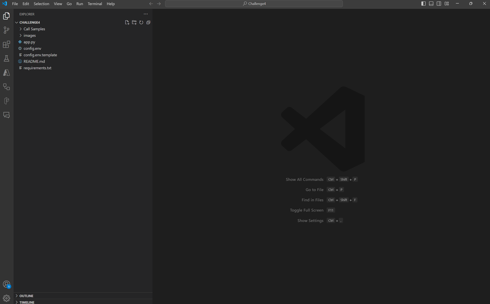
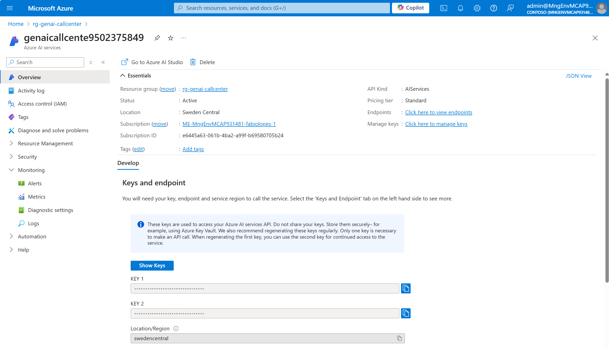
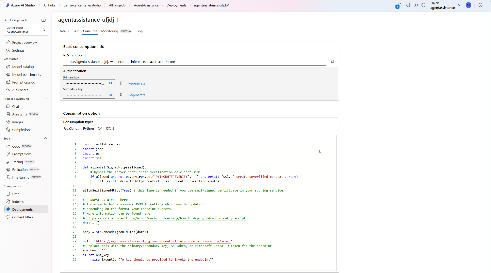
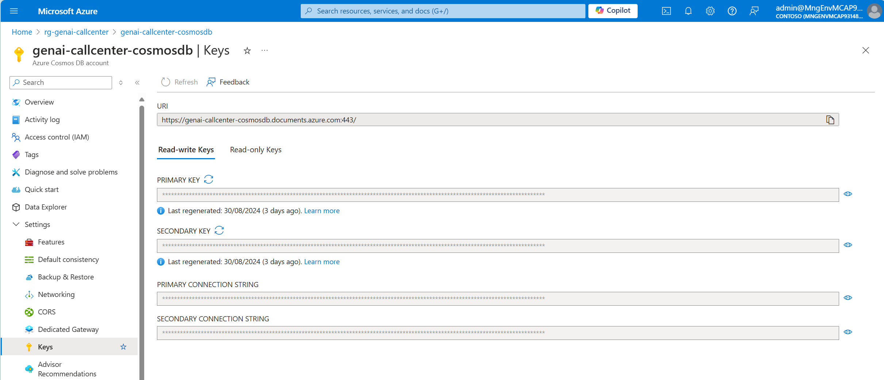
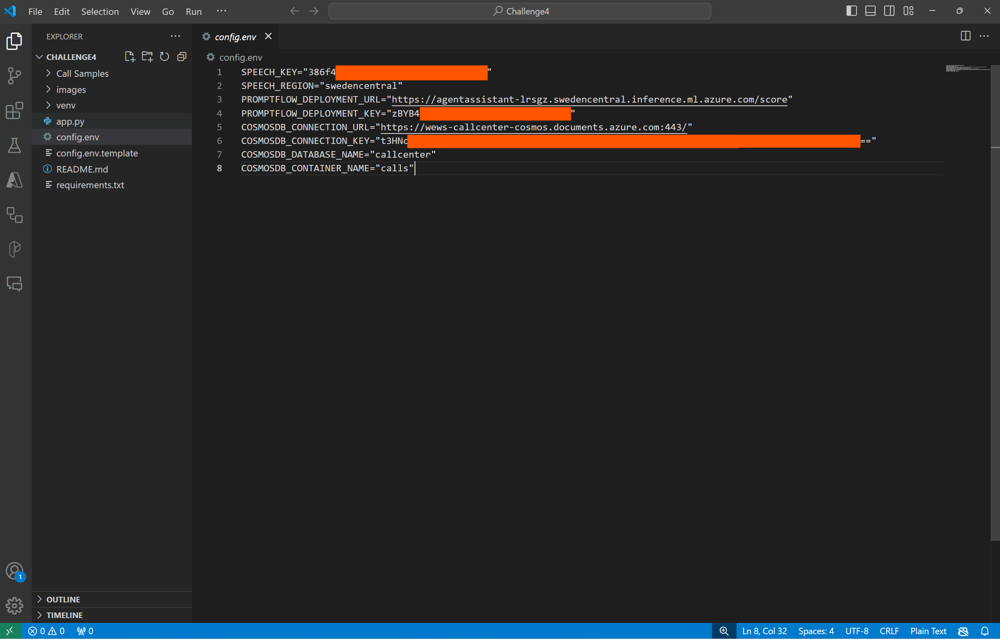
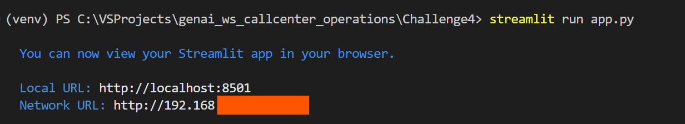
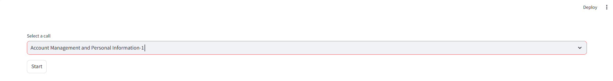
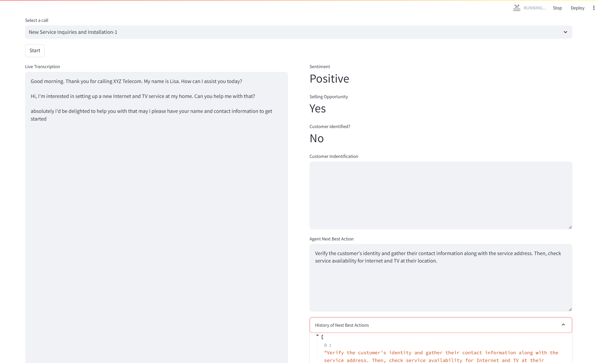

# Challenge 4 - Real-time call transcription and agent assistance

**Expected Duration:** 2h

## Introduction

**TO BE DONE**

## Our scenario

**TO BE DONE**

## Install the required programs
### Visual Studio Code
- Windows
    - Install [Visual Studio Code](https://code.visualstudio.com/)
- Linux
    - Install [Visual Studio Code](https://code.visualstudio.com/)
- Mac
    - Install [Visual Studio Code](https://code.visualstudio.com/)

### Python
- Windows
    - Install [Python 3.12.2](https://www.python.org/downloads/release/python-3125/)
- Linux
    - It is usually pre-installed. Check version with `python3 --version`.
- Mac
    - `brew install python3`

## Guide: Setup local environment
1. Clone the repository to your local machine.
2. Navigate to the chosen location and locate the `Challenge4` folder.
3. Open this folder in Visual Studio Code.

4. Open a new terminal in Visual Studio Code. (You can use the top bar of Visual Studio, in the `Terminal` tab).
5. Create the virtual environment by running the following command:
    - Windows
        - `python -m virtualenv venv`
    - Linux / Mac
        - `virtualenv -p python3 venv`
6. Activate the virtual environment by running the following command:
    - Windows
        - `.\venv\Scripts\activate.ps1`
    - Linux / Mac
        - `source ./venv/bin/activate`
7. Install the necessary packages to run the application:
    - Windows / Mac / Linux
        - `pip install -r requirements.txt`
8. You can close the terminal.
9. Navigate to the `Challenge4` folder.
10. Duplicate the `config.env.template` file and rename it to `config.env`.
11. Open the `config.env` file and fill in the necessary information.
    * Navigate to the [Azure portal](https://portal.azure.com/#home) and login with your account.
    * Navigate to your resource group.
    * Select the `Azure AI services` resource. In the `Overview` section, you will find the `KEY 1` and `Location/Region` information. Fill in the `SPEECH_KEY` and `SPEECH_REGION` fields in the `config.env` file.
    
    * Navigate to your resource group.
    * Select the `Azure AI Studio` resource and launch it. Navigate to `Deployments` and select the deployment created in the previous [Challenge 3](../Challenge3/README.md). In the `Consume` section, you will find the `REST Endpoint` and `Primary Key`. Fill in the `PROMPTFLOW_DEPLOYMENT_URL` and `PROMPTFLOW_DEPLOYMENT_KEY` field in the `config.env` file.
    
    * Navigate to your resource group.
    * Select the `Cosmos DB Account` resource. In the left pane, select `Keys`. You will find the `URI` and `PRIMARY KEY` information (in the Read-write Keys). Fill in the `COSMOSDB_CONNECTION_URL` and `COSMOSDB_CONNECTION_KEY` fields in the `config.env` file.
    
    * Fill in the `COSMOSDB_DATABASE_NAME` and `COSMOSDB_CONTAINER_NAME` fields in the `config.env` file with the values specified in [Challenge 1](../Challenge1/README.md). If you followed the guide, the values should be `callcenter` and `calls`, respectively.
    

## Guide: Explain the app

**TO BE DONE**

## Guide: Run the app
1. Navigate to the `Challenge4` folder.
2. Open a terminal window and run the following command: `streamlit run app.py`

3. A new tab will open in your default browser with the application running. If not, use the *Local URL* provided in the terminal.
4. From the dropdown list, you can select a [Call Sample](<../Challenge4/Call Samples/Audio/>) and click on the `Start` button.

5. The application will start transcribing the call and providing suggestions to the agent in real time. Every time the application detects that a complete phrase was spoken, it will call the Prompt Flow endpoint and update all the info to the agent.

## Conclusion
Add things here.

## Learning Material
Add things here.