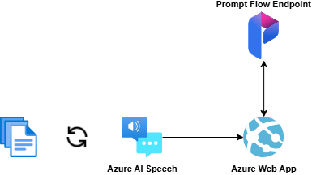

# Challenge 4 - Real-time call transcription and agent assistance

**Expected Duration:** 60 minutes

## Introduction

In the previous Challenge you created a Prompt Flow endpoint which can be used in an application to execute the flow defined in the previous challenges. In this challenge, you will create a real-time call transcription application that will assist the agent during the call. The application will transcribe the call in real time and provide suggestions to the agent based on the conversation and also save the call information in a Cosmos DB database.

To this extent, we will use a pre-recorded call sample and transcribe it in real time. The application will use the Azure Speech Service to transcribe the call in real-time and our application will call the Prompt Flow endpoint each time a new sentence has been spoken to provide suggestions to the agent. After the conversation finishes, the transcription is saved in a Cosmos DB database.



In a real-world scenario, you would use Azure AI Speech to transcribe the incoming call in real-time and not use pre-recorded calls. However, for the purpose of this challenge, we will use pre-recorded calls to simulate the real-time transcription.

The sample calls have been recorded and are available in the [Call Samples/Audio](<../Challenge4/Call Samples/Audio/>) folder. To generate the calls, the SOPs defined in the previous challenges were provided to an LLM which generated 3 transcripts per type of SOP and, using Azure AI Speech, the transcripts were converted to audio files.

You will be able to test the application with all of the Audio Samples or, if available to you, provide your own by including them in the [Call Samples](<../Challenge4/Call Samples/Audio/>) folder.

## Install the required programs 

### GitHub Codespaces

GitHub Codespaces is a cloud-based development environment that allows you to code from anywhere. It provides a fully configured environment that can be launched directly from any GitHub repository, saving you from lengthy setup times. You can access Codespaces from your browser, Visual Studio Code, or the GitHub CLI, making it easy to work from virtually any device.

To open this repository in GitHub Codespaces, click on the button below:

[](https://codespaces.new/frsl92/genai_ws_callcenter_operations/tree/main)

**NOTE:** If GitHub Codespaces is not enabled in your GitHub organization, you can enable it by following the instructions [here](https://docs.github.com/en/codespaces/managing-codespaces-for-your-organization/enabling-or-disabling-github-codespaces-for-your-organization), or, if you cannot change your GitHub organization's settings, create free personal GitHub account [here](https://github.com/signup?ref_cta=Sign+up&ref_loc=header+logged+out&ref_page=%2F&source=header-home).

After your Codespaces is created, please continue with next section.

## Guide: Setup environment

You will need to configure the environment variables in the `config.env` file to enable application access to previously deployed resources in Azure. The `config.env` file is a configuration file that contains the environment variables for the application. The `config.env` file is automatically created running the following command within the terminal in your Codespace:

```bash
cd Challenge4
./get-keys.sh --resource-group <resource-group-name>
```

**NOTE:** Replace `<resource-group-name>` with the resource group name created in `Challenge1`.

This script will connect to Azure and fetch the necessary keys and populate the `config.env` file with the required values in the `Challenge4` directory of the repository. If needed, script will prompt you to sign in to your Azure account.

**NOTE:** In a production scenario, the application would be retrieving the credentials from a secure location, such as Azure Key Vault. For the purpose of this challenge, to simplify, we are storing the credentials in a configuration file.

## Guide: Run the app
1. Navigate to the `Challenge4` folder.
2. Open a terminal window and run the following command: `streamlit run app.py`

3. Codespaces will prompt you with a notification to open the URL in new browser tab. Alternativellym you can use the *Ports* tab provided near the terminal to open the application.
4. From the dropdown list, you can select a [Call Sample](<../Challenge4/Call Samples/Audio/>) and click on the `Start` button.

5. The application will start transcribing the call and providing suggestions to the agent in real time. Every time the application detects that a complete phrase was spoken, it will call the Prompt Flow endpoint and update all the info to the agent.

6. Notice that in the terminal where streamlit was executed you will see the results of the transcription provided by Azure AI Speech in real-time, including each new word that it is able to capture.
6. After the transcription is finished, the application will save the call information in the Cosmos DB database.
7. Navigate to the [Azure portal](https://portal.azure.com/#home) and login with your account.
8. Navigate to your resource group.
9. Select the `Azure Cosmos DB` resource.
10. Navigate to the resource page and, from the left tabs, select `Data Explorer`.
11. You should see your database and container created in [Challenge 1](../Challenge1/README.md).
12. With the transcriptions available in the `calls` container, you can later use the data to analyze the calls and evaluate the performance of your call center operations. You can find an example of this [here](https://github.com/microsoft/Customer-Service-Conversational-Insights-with-Azure-OpenAI-Services).

## Conclusion
In this challenge, you created a real-time call transcription application that assists the agent during the call. The application transcribes the call in real-time and provides suggestions to the agent based on the conversation. The application also saves the call information in a Cosmos DB database.

## Learning Material
- [Customer Service Conversational Insights with Azure OpenAI Services](https://github.com/microsoft/Customer-Service-Conversational-Insights-with-Azure-OpenAI-Services)
- [Streamlit](https://streamlit.io/)
- [Azure Key Vault](https://learn.microsoft.com/en-us/azure/key-vault/general/basic-concepts)