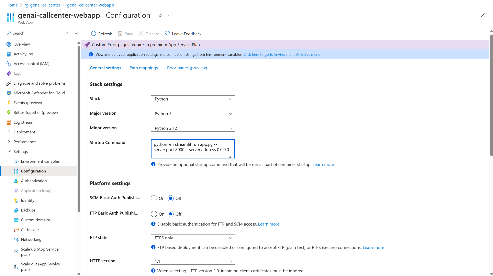
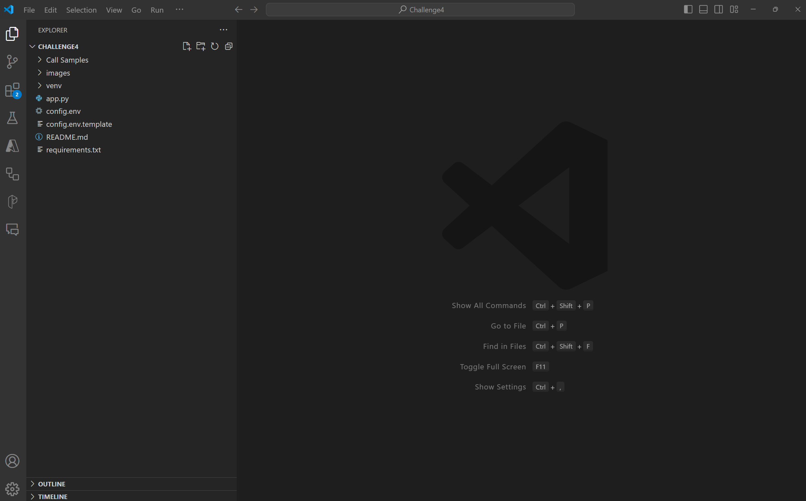
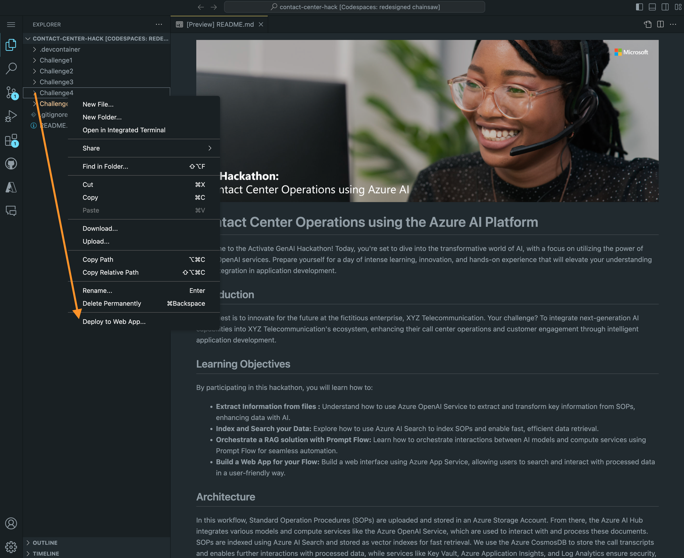
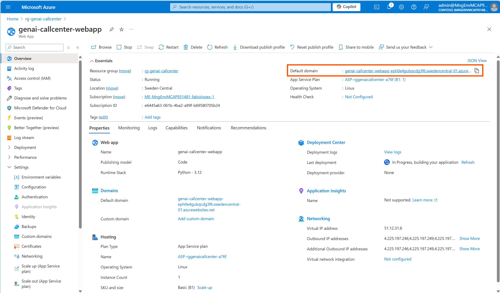

# Challenge 5 - Deploy the application

**Expected Duration:** 30 minutes

## Introduction
In this challenge, we will deploy our streamlit application to an Azure Web App Service to be available for usage outside of our local environment.

## Guide: Configure the Azure Web App Service to run Streamlit
1. Navigate to the [Azure portal](https://portal.azure.com/#home) and login with your account.
2. Navigate to your resource group.
3. Locate your Azure App Service (not the Azure App Service Plan created automatically for you) and open it.
    * In the left pane, select `Settings` and `Configuration`.
    * Locate the *Startup Command*. Replace the default value with:
    ```python -m streamlit run app.py --server.port 8000 --server.address 0.0.0.0```
    
    * Click on the `Save` button at the top.
4. Return to Visual Studio Code and open the `Challenge4` folder. Note: Open the `Challenge4` folder, not the `root` folder where all the Challenges reside.

5. Right click the empty space in the `Challenge4` directory within Visual Studio Code and select `Deploy to Web App`.

6. Select the Azure Web App created in [Challenge 1](../Challenge1/README.md) and deploy your Web App.
7. Wait for the deployment to complete.
8. Return to the Azure portal and navigate to your Azure Web App.
9. You can find the URL of your application in the `Overview` section, under the `Default domain` field.

10. Open the URL in your browser to access the application.
11. The first time you open your application it may take a few minutes to load. Subsequent loads will be faster.

## Guide: Delete your environment
1. Navigate to the [Azure portal](https://portal.azure.com/#home) and login with your account.
2. Navigate to your resource group.
3. Save all of the artifacts that you want to keep. For example, in your Prompt Flow, you can save the work done in the Prompt Flow page by downloading the files com the `Files` section.
3. Click `Delete resource group`. Follow the instructions and confirm the deletion.
4. Your resources will be deleted, along with all the resources within and, you will avoid future charges.

## Conclusion
In this challenge, you have successfully deployed your Streamlit application to an Azure Web App Service. You can now access your application from anywhere with an internet connection.